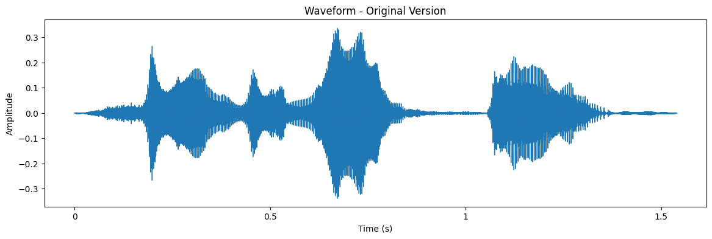
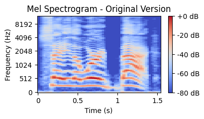
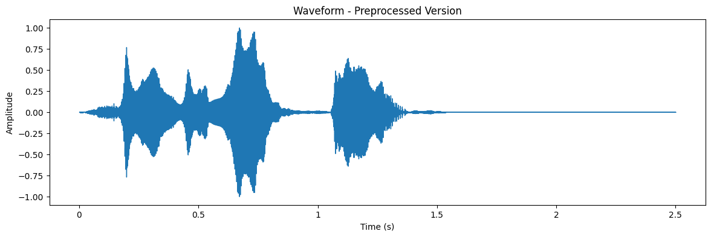
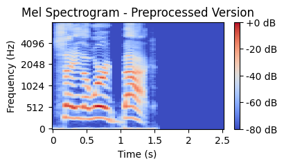

# Speech Emotion Recognition Using CRNN

This repository contains the implementation of a **Speech Emotion Recognition (SER)** model utilizing a **Convolutional Recurrent Neural Network (CRNN)**. The goal of this project is to classify human speech into six distinct emotions: **neutral**, **happy**, **sad**, **angry**, **fear**, and **disgust**. 


---

## 📂 **Datasets**
The model is trained on three popular datasets:
1. **Toronto Emotional Speech Set (TESS)**  
2. **Crowd-Sourced Emotional Multimodal Actors Dataset (CREMA-D)**  
3. **Ryerson Audio-Visual Database of Emotional Speech and Song (RAVDESS)**  

Each dataset has been preprocessed to maintain consistency, focusing on audio from female speakers for uniformity.

---

## 🔍 **Data Exploration**

The notebook `tess_explore.ipynb` is a file that we used to explore the TESS 
dataset and understand how we can preprocess, augment, and experiment with data.

### Original Unprocessed Audio



<audio controls>
  <source src="./resources/example_original_audio.wav" type="audio/wav">
  Your browser does not support the audio element.
</audio>



### Preprocessed Audio



<audio controls>
  <source src="./resources/example_preprocessed_audio.wav" type="audio/wav">
  Your browser does not support the audio element.
</audio>



---

## ⚙️ **Model Architecture**

### 1. Input Processing  
Raw audio is transformed into Mel-spectrograms with Fast-Fourier transformations  
to represent energy in a time-frequency domain.

### 2. CNN Module  
- Two convolutional layers extract spatial features.  
- Max-pooling, batch normalization, and dropout (0.3) are applied to reduce dimensions and prevent overfitting.

### 3. RNN Module  
- Two Bidirectional LSTM layers capture temporal dependencies with 128 and 64 hidden units.  
- Attention mechanisms enhance focus on key temporal features.

### 4. Output Layer  
- Dense layers consolidate extracted features.  
- Final softmax layer outputs probabilities for six emotion classes.

---

## 📊 **Results**
- **Baseline Model (ResNet-based CNN):** Achieved **78.99% accuracy**.  
- **CRNN Model:** Validation accuracy of **64%** and test accuracy of **61%**.  

The CRNN model underperformed due to limited dataset diversity and overfitting on small datasets. Simpler CNN models showed better generalization.

---

## 🛠 **How to Use (Linux)**

### 1. Clone the Repository
```bash
git clone https://github.com/RuthlessRu/vigilant-fishstick.git
cd vigilant-fishstick/notebooks
```

### 2. Download Datasets from Kaggle

```bash
python3 data_retrieval.py
```

### 3. Process Datasets
```bash
python3 preprocess_dataset.py
```

### 4. Train and Evaluate Model

Replece `<model>` with any of the following: `baseline_split2`, `baseline`, 
`pytorch_conv_split2`, `pytorch_conv`, `pytorch_crnn_split2`, `pytorch_crnn`.

- *Split2*: Combines TESS, CREMAD, and RAVDESS datasets, then splits them into 
training, validation, and testing sets.
- *Non-Split2*: Uses TESS and CREMAD for training and validation, while RAVDESS 
is reserved for testing.

```bash
python3 <model>.py
```

---

## 🖥 **Contributions**
- **Adam Kanoun (adam.kanoun@mail.utoronto.ca):** Model building and data preprocessing  
- **David He (davidhe.he@mail.utoronto.ca):** Performance analysis and revisions
- **Jai Dey (jai.dey@mail.utoronto.ca):** Performance analysis and revisions
- **Sizhe Fan (sizhe.fan@mail.utoronto.ca):** Found dataset and analyzed data

---

## 📈 **Future Improvements**
- Incorporating diverse datasets with multilingual and multi-gender speakers.  
- Simplifying architecture to reduce overfitting on small datasets.  
- Exploring transformer-based models for SER.


